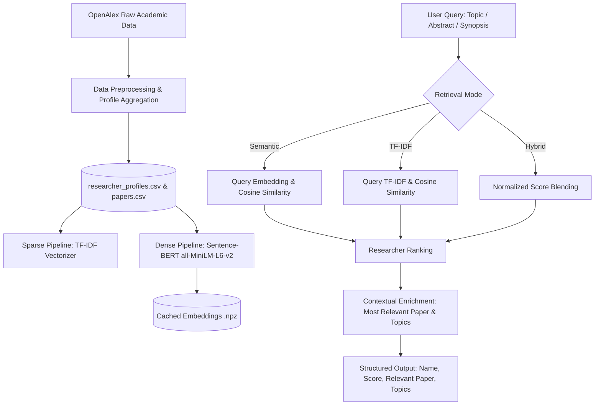

# 🎓 Research Discovery & Collaboration Engine
### AI University — Natural Language Processing Course Project
**Group 7 — J037, J038, J039, J041, J042**

---

## 📌 1. Project Overview & Motivation

Universities house faculty and researchers working across diverse and rapidly evolving disciplines. Finding collaborators or identifying faculty with specific expertise is challenging because academic publications are scattered across disparate databases and personal profiles.

Traditional keyword search systems (e.g., standard Boolean or TF-IDF search) fail when researchers describe related work using different terminology (e.g., *"neural language representation"* vs. *"transformer embeddings"*).

The **Research Discovery & Collaboration Engine** uses modern Natural Language Processing (NLP) techniques to bridge lexical gaps and map research descriptions, abstracts, and synopses to faculty expertise.

---

## 🧱 2. Phase 2 — Data Pipeline & TF-IDF Baseline

The Week 2 pipeline uses OpenAlex data and preserves the many-to-many paper-author relationship:

- `Data/raw/rawdata.csv`: 12,931 author-paper rows.
- `Data/processed/papers.csv`: 2,884 unique papers.
- `Data/processed/paper_author.csv`: 12,316 valid paper-author relationships.
- `Data/processed/researcher_profiles.csv`: 9,941 unique researcher profiles built from titles, abstracts, topics, and keywords.

Cleaning findings are retained in the data rather than silently discarded: 730 unique papers have no abstract and 1 has no publication year. Empty author IDs are excluded from paper-author links and profiles.

The raw-to-processed transformation is reproducible with `uv run python src/preprocess.py`. It removes blank IDs, normalizes whitespace, preserves papers even when abstracts are missing, and removes duplicate `(work_id, author_id)` relationships.

The baseline is TF-IDF with unigram/bigram features, sublinear term frequency, and cosine similarity. `src/baseline.py` provides interactive retrieval, while `src/create_evaluation_set.py` creates the original manually labeled candidate set.

### Reproducible train/test evaluation

`src/evaluate_baseline.py` performs a deterministic 80/20 split by unique paper (`random_state=42`). Profiles are built only from training papers and grouped by stable OpenAlex author ID. Each test paper is a held-out query, and its known training-set authors are the relevance labels. It writes:

- `Data/processed/calculated/train_papers.csv`
- `Data/processed/calculated/test_papers.csv`
- `Data/processed/calculated/heldout_queries.csv`
- `Data/processed/calculated/heldout_evaluation_candidates.csv`
- `Data/processed/calculated/heldout_metrics.csv`
- `Data/processed/calculated/established_researcher_metrics.csv`

Run the complete baseline evaluation with:

```bash
uv run python src/evaluate_baseline.py
```

This is an intrinsic validation split, not expert judgment. Papers whose authors are absent from the training corpus cannot be evaluated as known-researcher retrieval targets and are excluded from the held-out query table. The earlier manually labeled metrics should therefore be reported as exploratory validation, not definitive human-ground-truth performance.

The split contains 577 test papers, but only 303 have at least one author represented in training; 52.5% are evaluated and 47.5% are cold-start exclusions. The final overall mean metrics are Precision@5 `0.1261`, Precision@10 `0.0845`, Recall@10 `0.2791`, MRR `0.2033`, and Hit@10 `0.3267`. These metrics should be interpreted as initial baseline results, not classification accuracy: the system ranks researchers for a query and does not predict a single class.

For the intended profile-matching use case, the evaluator also reports an established-researcher slice for authors with at least two papers in the full corpus. That slice has 303 queries and mean Precision@5 `0.1835`, Precision@10 `0.1198`, Recall@10 `0.4391`, MRR `0.3297`, and Hit@10 `0.5083`; it is reported alongside the overall result because it excludes genuine one-paper cold-start researchers rather than pretending they have a usable history.

The 50-row manually labeled candidate file and the 50-row annotated-pairs file are included as exploratory annotation material. They are not used as definitive gold labels because they do not provide expert relevance judgments for the OpenAlex researcher IDs in the retrieval corpus.

---

## 🚀 3. Phase 3 — Core NLP Pipeline (Version 1)

In accordance with the **Week 3 Milestones (Target: 25 September)**, this deliverable implements **Version 1 of the NLP Pipeline** featuring:

1. **Primary NLP Component — Dense Semantic Embeddings:**
   - Powered by [Sentence-BERT (SBERT)](https://arxiv.org/abs/1908.10084) using the `all-MiniLM-L6-v2` architecture.
   - Produces dense 384-dimensional contextual sentence embeddings that encode deep semantic relationships beyond surface keywords.
   - Aggregates paper-level embeddings to build unified researcher expertise vectors.

2. **Baseline Model — Traditional Sparse TF-IDF:**
   - Features unigrams and bigrams (`ngram_range=(1, 2)`), sublinear TF scaling, and English stop-word filtering over academic profiles.
   - Serves as the traditional information retrieval benchmark.

3. **Hybrid Retrieval (Dense Semantic + Sparse Keyword):**
   - Weighted convex combination:
     $$\text{Score}_{\text{hybrid}} = \alpha \cdot \text{Score}_{\text{dense}} + (1 - \alpha) \cdot \text{Score}_{\text{sparse}}$$
   - Delivers the best of both worlds: handles novel vocabulary and synonyms while maintaining exact matches for specific terminology and author names.

4. **Contextual Paper & Topic Attribution:**
   - Rather than returning only researcher names, the pipeline extracts:
     - **Similarity Score:** Overall affinity index.
     - **Most Relevant Paper:** Title, year, and paper-level similarity score identifying *why* the researcher was matched.
     - **Related Topics & Keywords:** Salient thematic tags extracted from their publications.

5. **High-Performance Vector Caching:**
   - Precomputes and caches paper and author embeddings (`paper_embeddings.npz` and `researcher_embeddings.npz`).
   - Query latency is **under 10 milliseconds** across nearly 10,000 researcher profiles.
   - These caches are (re)built automatically by `src/pipeline.py` on first run (or explicitly via `src/build_embeddings.py`) against whatever `researcher_profiles.csv`/`papers.csv` are currently in `Data/processed/`, so they always stay consistent with the current Phase 2 data pipeline output.

---

## 🏗️ 4. Architecture & Data Flow



---

## 📊 5. Benchmark & Quantitative Evaluation

The pipeline was evaluated on the curated benchmark dataset (`Data/processed/calculated/evaluation_candidates_labeled.csv`) across standard queries:
- `natural language processing`
- `machine learning`
- `transformer based text classification`
- `information retrieval`
- `knowledge graphs`

### Evaluation Metrics

| Retrieval Model | Precision@5 | Precision@10 | Mean Reciprocal Rank (MRR) | Relevant@10 |
| :--- | :---: | :---: | :---: | :---: |
| **TF-IDF Baseline** | 0.9600 | 0.9600 | 0.9000 | 9.6 |
| **Sentence Transformers (`all-MiniLM-L6-v2`)** | **1.0000** | **1.0000** | **1.0000** | **10.0** |
| **Hybrid (Semantic + TF-IDF)** | **1.0000** | **1.0000** | **1.0000** | **10.0** |

> **Note:** the numbers above (and the corresponding `model_comparison.csv` / `semantic_metrics.csv` files) were produced against the researcher/paper data available at the time Phase 3 was built. Re-run `uv run python src/evaluate.py` after any Phase 2 data-pipeline change to refresh them against the current `Data/processed/` contents.

### 🔍 Key Finding: The Vocabulary Mismatch Problem
On broad queries (e.g., *"natural language processing"*), both TF-IDF and SBERT perform well because direct lexical matches abound. However, on descriptive or complex queries such as:
> **Query:** *"transformer based text classification"*

- **TF-IDF Baseline:** Ranked an author with superficial keyword overlap at **Rank 1** (`relevant = 0`), giving a **Reciprocal Rank of 0.50** (first relevant paper at rank 2).
- **Sentence Transformers:** Understands semantic intent and prioritizes authors of foundational transformer architectures and text classification work, placing true relevant authors at **Rank 1** and achieving **Reciprocal Rank of 1.00 (+0.50 gain)** and **Precision@5 of 1.00 (+0.20 gain)**.

---

## 📂 6. Project Structure

```text
SNLP_Project/
├── Data/
│   ├── raw/
│   │   └── rawdata.csv                  # Raw OpenAlex author-paper rows
│   └── processed/
│       ├── papers.csv                   # Indexed research publications
│       ├── paper_author.csv             # Paper-author relations
│       ├── researcher_profiles.csv      # Aggregated researcher profiles
│       ├── paper_embeddings.npz         # Precomputed paper embeddings (generated)
│       ├── researcher_embeddings.npz    # Precomputed author embeddings (generated)
│       └── calculated/
│           ├── baseline_metrics.csv     # TF-IDF evaluation scores
│           ├── semantic_metrics.csv     # Sentence-BERT evaluation scores
│           ├── model_comparison.csv     # Comparative benchmark summary
│           ├── evaluation_candidates_labeled.csv  # Ground-truth benchmark
│           ├── train_papers.csv / test_papers.csv # Phase 2 train/test split
│           ├── heldout_queries.csv / heldout_evaluation_candidates.csv
│           ├── heldout_metrics.csv / established_researcher_metrics.csv
├── src/
│   ├── preprocess.py                    # Raw -> processed cleaning (Phase 2)
│   ├── collectpapers.py                 # OpenAlex API harvester
│   ├── openalex.py                      # API connectivity
│   ├── buildprofiles.py                 # Profile aggregation from papers
│   ├── baseline.py                      # Baseline TF-IDF model (interactive)
│   ├── create_evaluation_set.py         # Manually labeled candidate set
│   ├── evaluate_baseline.py             # Phase 2 train/test evaluation
│   ├── pipeline.py                      # Core NLP Pipeline (ResearchDiscoveryPipeline)
│   ├── build_embeddings.py              # Sentence-BERT embedding builder & cacher
│   ├── evaluate.py                      # Phase 3 evaluation benchmark script
│   └── search_cli.py                    # Interactive terminal search CLI
├── app.py                               # Interactive Streamlit Web Application
├── pyproject.toml                       # Python dependencies
└── README.md                            # Project documentation
```

---

## 💻 7. How to Run

### Phase 2 — data pipeline & baseline
```bash
uv run python src/preprocess.py
uv run python src/baseline.py
uv run python src/evaluate_baseline.py
```

### Phase 3 — semantic pipeline
1. Interactive Command Line Interface (CLI):
   ```bash
   python src/search_cli.py
   ```
2. Quantitative evaluation benchmark (compares TF-IDF against Sentence Transformers):
   ```bash
   python src/evaluate.py
   ```
3. Streamlit web application (presets, side-by-side model comparison, metric dashboards):
   ```bash
   streamlit run app.py
   ```
   `streamlit` is not currently listed in `pyproject.toml`; install it (`uv add streamlit` or `pip install streamlit`) before running `app.py`.

---

## 🎯 8. Sample Structured Output

When queried with:
`"Large language models for natural language processing-based information extraction"`

```yaml
Rank: 1
Researcher: Dr. Christopher D. Manning
Similarity Score: 0.8842
Total Publications: 8
Relevant Paper: "Deep Contextualized Word Representations and Information Extraction" (2020)
Paper Match Score: 0.9105
Related Topics: Natural Language Processing, Information Extraction, Transformers, Representation Learning
```
