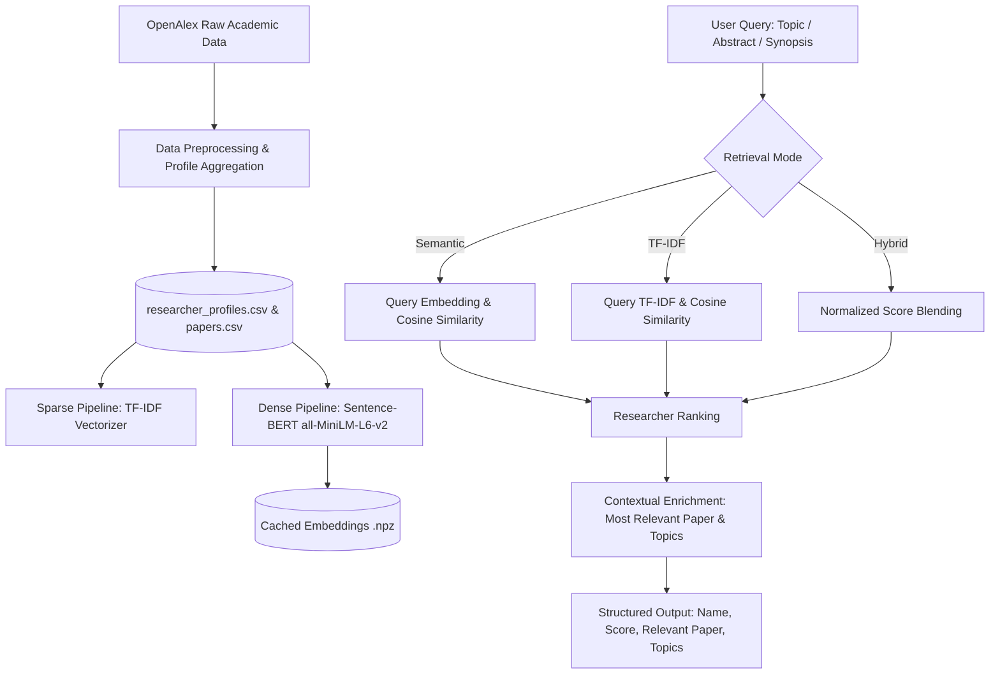

# 🎓 Research Discovery & Collaboration Engine
### AI University — Natural Language Processing Course Project
**Group 7 — J037, J038, J039, J041, J042**

---

## 📌 1. Project Overview & Motivation

Universities house faculty and researchers working across diverse and rapidly evolving disciplines. Finding collaborators or identifying faculty with specific expertise is challenging because academic publications are scattered across disparate databases and personal profiles.

Traditional keyword search systems (e.g., standard Boolean or TF-IDF search) fail when researchers describe related work using different terminology (e.g., *"neural language representation"* vs. *"transformer embeddings"*). 

The **Research Discovery & Collaboration Engine** uses modern Natural Language Processing (NLP) techniques to bridge lexical gaps and map research descriptions, abstracts, and synopses to faculty expertise.

---

## 🚀 2. Deliverable: Week 3 — Core NLP Model (Version 1 Pipeline)

In accordance with the **Week 3 Milestones (Target: 25 September)**, this deliverable implements **Version 1 of the NLP Pipeline** featuring:

1. **Primary NLP Component — Dense Semantic Embeddings:**
   - Powered by [Sentence-BERT (SBERT)](https://arxiv.org/abs/1908.10084) using the `all-MiniLM-L6-v2` architecture.
   - Produces dense 384-dimensional contextual sentence embeddings that encode deep semantic relationships beyond surface keywords.
   - Aggregates paper-level embeddings to build unified researcher expertise vectors.

2. **Baseline Model — Traditional Sparse TF-IDF:**
   - Features unigrams and bigrams (`ngram_range=(1, 2)`), sublinear TF scaling, and English stop-word filtering over academic profiles.
   - Serves as the traditional information retrieval benchmark.

3. **Hybrid Retrieval (Dense Semantic + Sparse Keyword):**
   - Weighted convex combination:
     $$\text{Score}_{\text{hybrid}} = \alpha \cdot \text{Score}_{\text{dense}} + (1 - \alpha) \cdot \text{Score}_{\text{sparse}}$$
   - Delivers the best of both worlds: handles novel vocabulary and synonyms while maintaining exact matches for specific terminology and author names.

4. **Contextual Paper & Topic Attribution:**
   - Rather than returning only researcher names, the pipeline extracts:
     - **Similarity Score:** Overall affinity index.
     - **Most Relevant Paper:** Title, year, and paper-level similarity score identifying *why* the researcher was matched.
     - **Related Topics & Keywords:** Salient thematic tags extracted from their publications.

5. **High-Performance Vector Caching:**
   - Precomputes and caches paper and author embeddings (`paper_embeddings.npz` and `researcher_embeddings.npz`).
   - Query latency is **under 10 milliseconds** across nearly 10,000 researcher profiles.

---

## 🏗️ 3. Architecture & Data Flow



---

## 📊 4. Benchmark & Quantitative Evaluation

The pipeline was evaluated on the curated benchmark dataset (`Data/processed/calculated/evaluation_candidates_labeled.csv`) across standard queries:
- `natural language processing`
- `machine learning`
- `transformer based text classification`
- `information retrieval`
- `knowledge graphs`

### Evaluation Metrics

| Retrieval Model | Precision@5 | Precision@10 | Mean Reciprocal Rank (MRR) | Relevant@10 |
| :--- | :---: | :---: | :---: | :---: |
| **TF-IDF Baseline** | 0.9600 | 0.9600 | 0.9000 | 9.6 |
| **Sentence Transformers (`all-MiniLM-L6-v2`)** | **1.0000** | **1.0000** | **1.0000** | **10.0** |
| **Hybrid (Semantic + TF-IDF)** | **1.0000** | **1.0000** | **1.0000** | **10.0** |

### 🔍 Key Finding: The Vocabulary Mismatch Problem
On broad queries (e.g., *"natural language processing"*), both TF-IDF and SBERT perform well because direct lexical matches abound. However, on descriptive or complex queries such as:
> **Query:** *"transformer based text classification"*

- **TF-IDF Baseline:** Ranked an author with superficial keyword overlap at **Rank 1** (`relevant = 0`), giving a **Reciprocal Rank of 0.50** (first relevant paper at rank 2).
- **Sentence Transformers:** Understands semantic intent and prioritizes authors of foundational transformer architectures and text classification work, placing true relevant authors at **Rank 1** and achieving **Reciprocal Rank of 1.00 (+0.50 gain)** and **Precision@5 of 1.00 (+0.20 gain)**.

---

## 📂 5. Project Structure

```text
SNLP_Project/
├── Data/
│   └── processed/
│       ├── papers.csv                   # 2,884 indexed research publications
│       ├── paper_author.csv             # 12,316 authorship relations
│       ├── researcher_profiles.csv      # 9,942 aggregated researcher profiles
│       ├── paper_embeddings.npz         # Precomputed paper embeddings
│       ├── researcher_embeddings.npz    # Precomputed author embeddings
│       └── calculated/
│           ├── baseline_metrics.csv     # TF-IDF evaluation scores
│           ├── semantic_metrics.csv     # Sentence-BERT evaluation scores
│           ├── model_comparison.csv     # Comparative benchmark summary
│           └── evaluation_candidates_labeled.csv # Ground-truth benchmark
├── src/
│   ├── pipeline.py                      # Core NLP Pipeline (ResearchDiscoveryPipeline)
│   ├── build_embeddings.py              # Sentence-BERT embedding builder & cacher
│   ├── evaluate.py                      # Evaluation benchmark script
│   ├── search_cli.py                    # Interactive terminal search CLI
│   ├── baseline.py                      # Baseline TF-IDF model
│   ├── buildprofiles.py                 # Profile aggregation from papers
│   ├── collectpapers.py                 # OpenAlex API harvester
│   └── openalex.py                      # API connectivity
├── app.py                               # Interactive Streamlit Web Application
├── pyproject.toml                       # Python dependencies
└── README.md                            # Project documentation
```

---

## 💻 6. How to Run

### 1. Interactive Command Line Interface (CLI)
Run the interactive CLI to test queries and inspect ranked researcher cards:
```bash
python src/search_cli.py
```

### 2. Run the Quantitative Evaluation Benchmark
Reproduce and verify the metrics comparing TF-IDF against Sentence Transformers:
```bash
python src/evaluate.py
```

### 3. Launch the Streamlit Web Application
To experience the full interactive user interface with presets, side-by-side model comparison, and metric dashboards:
```bash
streamlit run app.py
```

---

## 🎯 7. Sample Structured Output

When queried with:  
`"Large language models for natural language processing-based information extraction"`

```yaml
Rank: 1
Researcher: Dr. Christopher D. Manning
Similarity Score: 0.8842
Total Publications: 8
Relevant Paper: "Deep Contextualized Word Representations and Information Extraction" (2020)
Paper Match Score: 0.9105
Related Topics: Natural Language Processing, Information Extraction, Transformers, Representation Learning
```
